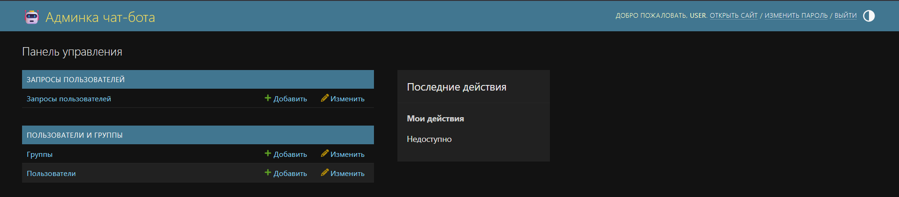
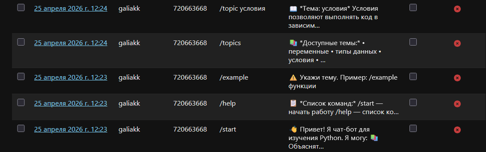

# 🤖 Python Learning Bot

A chatbot for learning the basics of Python programming.

---

## 📌 Project Description

**Python Learning Bot** is an interactive chatbot that helps beginner programmers learn Python.
The bot explains topics, shows code examples, gives assignments, and runs mini-quizzes.

The project has two interfaces:
- **Telegram bot** — available via the Telegram messenger
- **Django admin panel** — for managing user requests at http://127.0.0.1:8000/admin

All user requests are saved to an SQLite database and accessible via the **Django admin panel**.
The administrator can view request history, leave notes, and mark questions as resolved.

---

## 🛠 Technologies Used

| Technology | Purpose |
|---|---|
| Python 3.10+ | Main language |
| pyTelegramBotAPI | Telegram bot |
| Django 4.2 | Web framework and admin panel |
| SQLite | Database |
| HTML / CSS / JS | Frontend templates |

---

## 📁 Project Structure

```
bot_project/
├── bot/
│   └── bot.py                  # Telegram bot
├── admin_panel/
│   ├── manage.py
│   ├── admin_panel/
│   │   ├── settings.py
│   │   ├── urls.py
│   │   └── wsgi.py
│   └── queries/
│       ├── models.py            # UserQuery and ChatMessage models
│       ├── admin.py             # Django admin panel
│       ├── bot_logic.py         # Shared bot logic
│       └── migrations/
├── quotes.txt                   # Quotes for /quote command
└── requirements.txt
```

---

## ⚙️ Installation

### 1. Unzip or clone the project

```bash
cd bot_project
```

### 2. Install dependencies

```bash
pip install -r requirements.txt
```

### 3. Add your Telegram bot token

Open `bot/bot.py` and replace:
```python
BOT_TOKEN = "YOUR_BOT_TOKEN"
```
Get your token from [@BotFather](https://t.me/BotFather) on Telegram.

### 4. Set up the database

```bash
cd admin_panel
python manage.py migrate
```

### 5. Create an admin user

```bash
python manage.py createsuperuser
```
Enter a username, email (optional), and password.

---

## 🚀 Running the Project

### Django admin panel

```bash
cd admin_panel
python manage.py runserver
```

| URL | Description |
|---|---|
| http://127.0.0.1:8000/admin/ | Admin panel |
| http://127.0.0.1:8000/admin/queries/userquery/ | User request history |

### Telegram bot (separate terminal)

```bash
python bot/bot.py
```

---

## 💬 Bot Usage Examples

### Command `/start`
```
User: /start

Bot: 👋 Hello! I am a chatbot for learning Python.
     Available commands:
     /help — list of commands
     /topics — list of topics
     /topic [topic] — topic explanation
     ...
```

### Command `/topic loops`
```
User: /topic циклы

Bot: 📖 Topic: циклы
     Loops help repeat actions. Python has for and while loops.
```

### Command `/example functions`
```
User: /example функции

Bot: 💻 Example for topic «функции»:
     def greet(name):
         print("Hello,", name)
     greet("Aliya")
```

### Command `/task lists`
```
User: /task списки

Bot: ✏️ Task for topic «списки»:
     Create a list of 5 numbers and print the second and last elements.
```

### Command `/quiz`
```
User: /quiz

Bot: 🎯 Question:
     Which function is used to print text to the screen?
     Enter your answer:

User: print

Bot: ✅ Correct! Well done! 🎉
```

### Command `/quote`
```
User: /quote

Bot: 💬 Any fool can write code that a computer can understand.
     Good programmers write code that humans can understand. — Martin Fowler
```

### Command `/weather Almaty`
```
User: /weather Almaty

Bot: 🌤 Weather in Almaty:
     🌡 Temperature: +22°C
     💨 Wind: 5 m/s
     ☁️ Cloudiness: 30%
     (This is a stub — connect a real weather API for live data)
```

### Unknown command
```
User: /hello

Bot: ❓ Unknown command: «/hello»
     Use /help to see the list of commands.
```

---

## 🖼 Screenshots

**Admin panel:**


**User request history:**


---

## 📋 All Bot Commands

| Command | Description |
|---|---|
| `/start` | Welcome message and command list |
| `/help` | Detailed list of commands |
| `/topics` | List of available topics |
| `/topic [topic]` | Explanation of a topic |
| `/example [topic]` | Code example for a topic |
| `/task [topic]` | Assignment for a topic |
| `/quiz` | Random quiz question |
| `/quote` | Random programming quote |
| `/weather [city]` | Weather in a city (stub) |
| `/progress` | Request statistics |

**Available topics:** variables, data types, conditions, loops, functions, lists, dictionaries, strings, input and output, operators
