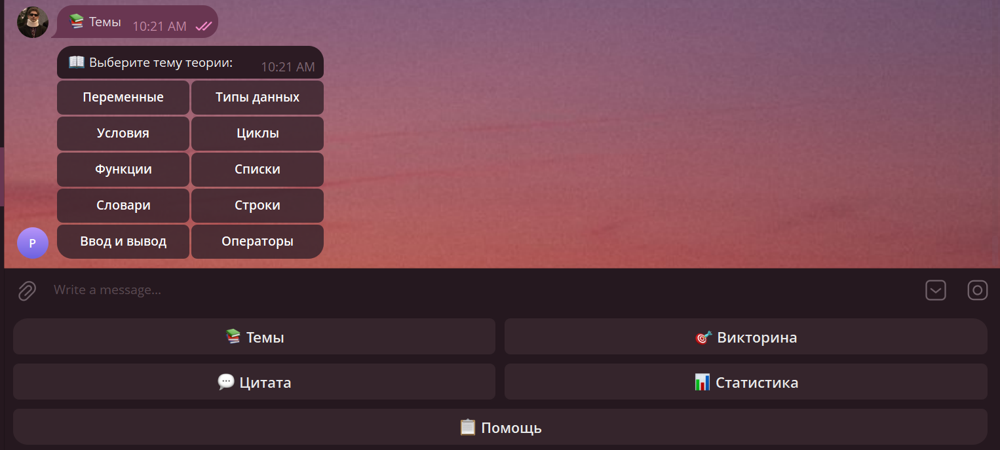

# 🤖 Python Learning Bot

Чат-бот для изучения основ программирования на Python.

---

## 📌 Описание проекта

**Python Learning Bot** — это интерактивный чат-бот, который помогает начинающим программистам изучать Python.  
Бот объясняет темы, показывает примеры кода, выдаёт задания и проводит мини-викторины.

Проект реализован в двух интерфейсах:
- **Telegram-бот** — доступен через мессенджер Telegram
- **Веб-интерфейс** — браузерный чат на Django (http://127.0.0.1:8000/admin)

Все запросы пользователей сохраняются в базу данных SQLite и доступны через **Django-админку**.  
Администратор может просматривать историю запросов, оставлять заметки и помечать вопросы как разобранные.

---

## 🛠 Используемые технологии

| Технология | Назначение |
|---|---|
| Python 3.10+ | Основной язык |
| pyTelegramBotAPI | Telegram-бот |
| Django 4.2 | Веб-интерфейс и админка |
| SQLite | База данных |
| HTML / CSS / JS | Фронтенд веб-чата |

---

## 📁 Структура проекта

```
bot_project/
├── bot/
│   └── bot.py                  # Telegram-бот
├── admin_panel/
│   ├── manage.py
│   ├── admin_panel/
│   │   ├── settings.py
│   │   ├── urls.py
│   │   └── wsgi.py
│   └── queries/
│       ├── models.py            # Модели UserQuery и ChatMessage
│       ├── views.py             # Веб-чат (chat, send, history)
│       ├── urls.py              # Маршруты
│       ├── admin.py             # Django-админка
│       ├── bot_logic.py         # Общая логика бота
│       ├── templates/queries/
│       │   ├── chat.html        # Страница веб-чата
│       │   └── history.html     # История сообщений
│       └── migrations/
├── quotes.txt                   # Цитаты для команды /quote
└── requirements.txt
```

---

## ⚙️ Инструкция по установке

### 1. Клонировать или распаковать проект

```bash
cd bot_project
```

### 2. Установить зависимости

```bash
pip install -r requirements.txt
```

### 3. Вставить токен Telegram-бота

Открыть файл `bot/bot.py` и заменить:
```python
BOT_TOKEN = "YOUR_BOT_TOKEN"
```
Токен получить у [@BotFather](https://t.me/BotFather) в Telegram.

### 4. Создать базу данных

```bash
cd admin_panel
python manage.py migrate
```

### 5. Создать администратора

```bash
python manage.py createsuperuser
```
Ввести логин, email (можно пропустить) и пароль.

---

## 🚀 Инструкция по запуску

### Веб-интерфейс (Django)

```bash
cd admin_panel
python manage.py runserver
```

| Адрес | Описание |
|---|---|
| http://127.0.0.1:8000/admin/queries/userquery/ | История сообщений |
| http://127.0.0.1:8000/admin/ | Панель администратора |

### Telegram-бот (отдельный терминал)

```bash
python bot/bot.py
```

---

## 💬 Примеры работы чат-бота

### Команда `/start`
```
Пользователь: /start

Бот: 👋 Привет! Я чат-бот для изучения Python.
     Доступные команды:
     /help — список команд
     /topics — список тем
     /topic [тема] — объяснение темы
     ...
```

### Команда `/topic циклы`
```
Пользователь: /topic циклы

Бот: 📖 Тема: циклы
     Циклы помогают повторять действия. В Python есть for и while.
```

### Команда `/example функции`
```
Пользователь: /example функции

Бот: 💻 Пример по теме «функции»:
     def greet(name):
         print("Привет,", name)
     greet("Алия")
```

### Команда `/task списки`
```
Пользователь: /task списки

Бот: ✏️ Задание по теме «списки»:
     Создай список из 5 чисел и выведи второй и последний элементы.
```

### Команда `/quiz`
```
Пользователь: /quiz

Бот: 🎯 Вопрос:
     Какая функция используется для вывода текста на экран?
     Введи ответ:

Пользователь: print

Бот: ✅ Верно! Молодец! 🎉
```

### Команда `/quote`
```
Пользователь: /quote

Бот: 💬 Любой дурак может написать код, который поймёт компьютер.
     Хороший программист пишет код, который поймёт человек. — Мартин Фаулер
```

### Команда `/weather Алматы`
```
Пользователь: /weather Алматы

Бот: 🌤 Погода в городе Алматы:
     🌡 Температура: +22°C
     💨 Ветер: 5 м/с
     ☁️ Облачность: 30%
     (Это заглушка — подключи реальный API погоды)
```

### Неизвестная команда
```
Пользователь: /привет

Бот: ❓ Неизвестная команда: «/привет»
     Используй /help для списка команд.
```

---

## 🖼 Скриншоты интерфейса

**Чат:**


**История сообщений:**


**Админка:**


**История сообщений** (`http://127.0.0.1:8000/admin/queries/userquery/`):
- Таблица всех сообщений с временем, отправителем и текстом

**Django-админка** (`http://127.0.0.1:8000/admin/`):
- Просмотр всех запросов пользователей Telegram-бота
- Фильтрация по дате, статусу
- Поле заметки администратора для ответа на сложные вопросы
- Пометка запросов как «Разобрано»

---

## 📋 Все команды бота

| Команда | Описание |
|---|---|
| `/start` | Приветствие и список команд |
| `/help` | Подробный список команд |
| `/topics` | Список доступных тем |
| `/topic [тема]` | Объяснение выбранной темы |
| `/example [тема]` | Пример кода по теме |
| `/task [тема]` | Задание по теме |
| `/quiz` | Случайный вопрос викторины |
| `/quote` | Случайная цитата о программировании |
| `/weather [город]` | Погода в городе (заглушка) |
| `/progress` | Статистика запросов |

**Доступные темы:** переменные, типы данных, условия, циклы, функции, списки, словари, строки, ввод и вывод, операторы
